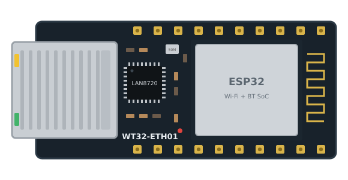
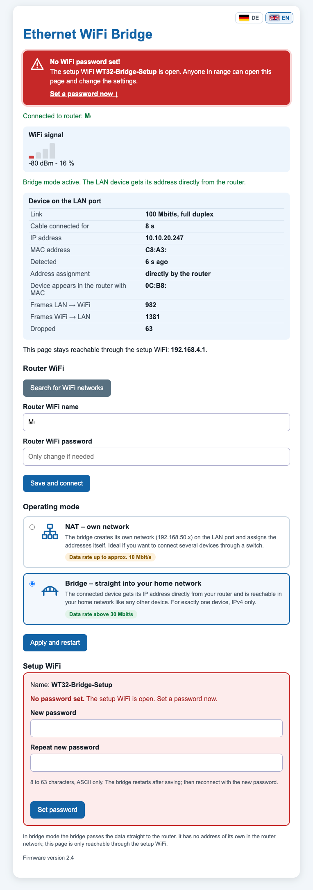

# WT32-ETH01 Ethernet to WiFi Bridge (ESP32 + LAN8720)

🇬🇧 **English** | 🇩🇪 [Deutsch](README.de.md)

[](CHANGELOG.md)
[](#hardware)
[](#build-and-flash)
[](LICENSE)
[](https://buymeacoffee.com/sykh)

**Version 2.4** – see the [changelog](CHANGELOG.md)

Firmware for the **WT32-ETH01 v1.4** (ESP32 + LAN8720) that brings a device with an Ethernet port
into your WiFi network: a **WiFi adapter for devices without WiFi**, or a **wireless bridge for the
Ethernet port** of a printer, smart TV, game console, NAS, PLC or measuring instrument. The device is
connected to the WT32-ETH01 by cable, and the WT32-ETH01 connects to your router over WiFi.

<p align="center">
  
</p>

```
[ LAN device ] ──cable── [ WT32-ETH01 ] ))) WiFi ))) [ Router ] ── Internet
```

## Web interface

<p align="center">
  
</p>

The web interface in bridge mode: WiFi signal strength, details of the device on the LAN port
(IP address from the router, link speed, packet counters), WiFi scan and operating mode selection.
The interface is available in English and German and can be switched with the flag buttons at the
top right.

## Features

- **Two operating modes**, selectable in the web interface:
  - **NAT – own network** (default): separate subnet `192.168.50.0/24` on the LAN port with a DHCP
    server, internet access through NAPT. Several devices possible (e.g. via a switch).
    Data rate up to approx. 10 Mbit/s.
  - **Bridge – straight into your home network** (experimental): the LAN device gets its IP address
    **directly from your router**. One device only, IPv4 only. Data rate above 30 Mbit/s.
- **Web interface** in **English and German** (switchable via flag buttons) via a dedicated setup
  WiFi (password changeable in the web interface):
  - WiFi scan and entry of the router credentials
  - WiFi signal strength
  - Info about the device on the LAN port: IP address, MAC address, link speed/duplex,
    connection time, plus packet counters in bridge mode
- Credentials and operating mode are stored permanently in flash (NVS).
- No external libraries required.

## Hardware

- WT32-ETH01 v1.4 by Wireless-Tag: ESP32 module, LAN8720 Ethernet PHY, RJ45 jack (10/100 Mbit/s),
  powered by 5 V **or** 3.3 V
- USB-to-serial adapter with **3.3 V** logic for flashing (e.g. CP2102 or CH340)

| Adapter | WT32-ETH01 |
|---------|------------|
| TX      | RX0 (GPIO3) |
| RX      | TX0 (GPIO1) |
| GND     | GND |
| 5V      | 5V (or 3.3 V to 3V3, never both) |

To flash, **connect IO0 to GND** and then power up the board. Remove the jumper afterwards and
restart.

### Header pinout

According to the [Wireless-Tag wiki](https://wiki.wireless-tag.com/docs/en/WT32-ETH01/board_features.html):

| Header 1 | Function | Header 2 | Function |
|----------|----------|----------|----------|
| EN | Enable (active high) | GND | Ground |
| CFG | IO32 (factory reset) | IO39 | input only |
| 485_EN | IO33 (RS485 enable) | IO36 | input only |
| RXD | IO5 (UART2 RX) | IO15 | GPIO |
| TXD | IO17 (UART2 TX) | IO14 | GPIO |
| GND | Ground | IO12 | GPIO |
| 3V3 | 3.3 V in/out | IO35 | input only |
| GND | Ground | IO4 | GPIO |
| 5V | 5 V in/out | IO2 | GPIO |
| LINK | Link LED | GND | Ground |

Flashing uses the programming pins **TXD0 (IO1), RXD0 (IO3), GND, 3V3, EN and IO0**.

Pins used internally: GPIO16 (LAN8720 oscillator enable), GPIO23 (MDC), GPIO18 (MDIO),
GPIO0 (50 MHz RMII clock input), PHY address 1.

## Build and flash

A detailed step-by-step guide (including a way without the command line) is in the
**[tutorial](docs/TUTORIAL.en.md)**.

Short version with [PlatformIO](https://platformio.org/):

```bash
pio run -t upload        # build and flash
pio device monitor       # serial output (115200 baud)
```

The firmware requires **Arduino Core 3.x (ESP-IDF 5)**. `platformio.ini` uses the
[pioarduino](https://github.com/pioarduino/platform-espressif32) platform for this. With the stock
`platform = espressif32` package (Arduino Core 2.x) the Ethernet part does not compile.

## Setup

1. Connect to the WiFi **`WT32-Bridge-Setup`**. On first start it is **open (no password)**.
2. Open `http://192.168.4.1`.
3. Select your router's WiFi, enter the password, save.
4. Set a password for the setup WiFi (the web interface shows a red warning until you do).
5. Connect the device to the LAN port.

## WiFi passwords

The bridge uses two passwords:

| Password | Where is it stored? | How to change it? |
|----------|---------------------|-------------------|
| **Setup WiFi** `WT32-Bridge-Setup` (initially **open**, no password) | in the ESP32's flash (NVS); an optional default can be set in `SETUP_AP_PASSWORD` in `src/main.cpp` | in the web interface under "Setup WiFi" (8–63 characters), the bridge restarts |
| **Router WiFi** | in the ESP32's flash (NVS), not in the code | enter it again in the web interface under "Router WiFi" and click "Save and connect" |

> **Important:** on first start the setup WiFi is open, so anyone in range could change the
> settings. The web interface shows a prominent red warning until you set a password; do this
> right after setup. Details: [tutorial, WiFi passwords](docs/TUTORIAL.en.md#7-find-and-change-the-wifi-passwords).

## Operating modes in detail

### NAT – own network

The bridge creates its own network on the LAN port and assigns the addresses itself. Ideal if you
want to connect several devices through a switch. Data rates up to approx. 10 Mbit/s.

- Bridge address on the LAN: `192.168.50.1` (gateway)
- DHCP range: `192.168.50.x`, DNS: `1.1.1.1`
- Internet traffic is routed over WiFi using NAPT.

### Bridge – straight into your home network (experimental)

The connected device gets its IP address directly from your router and is reachable in your home
network like any other device. Data rates above 30 Mbit/s.

A WiFi client may only send frames with its own MAC address. The bridge therefore rewrites the MAC
addresses in the frames, including DHCP and ARP packets. Espressif's
[`sta2eth`](https://github.com/espressif/esp-idf/tree/master/examples/network/sta2eth) example uses
the same technique.

Limitations:

- **one** device on the LAN port, **IPv4** only
- the router sees the device with the **WiFi MAC address of the bridge** (shown in the web
  interface). Static IP reservations in the router must use this MAC.
- the bridge has no IP address of its own in the router's network; the web interface is only
  reachable through the setup WiFi
- uses internal ESP-IDF WiFi functions (`esp_wifi_internal_*`), which may change with core updates
- after switching the operating mode, unplug the cable of the LAN device briefly so it requests a
  new address

## Project structure

```
platformio.ini            build configuration
src/main.cpp              firmware
docs/TUTORIAL.en.md       tutorial: build and flash (English)
docs/TUTORIAL.de.md       Tutorial: Kompilieren und Flashen (Deutsch)
docs/webinterface.png     screenshot of the web interface
docs/wt32-eth01.svg       board illustration
docs/social-preview.png   GitHub preview image
tools/release.sh          builds the firmware and creates a GitHub release
backup/main_nat_only.cpp  older version with NAT mode only
CHANGELOG.md              changelog (English)
CHANGELOG.de.md           Änderungsprotokoll (Deutsch)
LICENSE                   MIT license
```

## Versions

Current version: **2.4** – web interface in English and German with a language switch.
Ready-made firmware files are attached to each [release](../../releases).
All changes are listed in the **[changelog](CHANGELOG.md)**.

## Support

If this project helps you, I'd be happy about a coffee:

<a href="https://buymeacoffee.com/sykh"></a>

## Troubleshooting

The serial output (115200 baud) shows the current state, for example:

```
WT32-ETH01 Ethernet-WLAN-Bridge, Firmware 2.4
Betriebsart: NAT
DHCP server started on interface ETH_LAN with IP: 192.168.50.1
Ethernet-LAN: 192.168.50.1, DHCP-Server laeuft
Ethernet-Kabel verbunden (100 Mbit/s, Vollduplex)
LAN-Geraet AA:BB:CC:DD:EE:FF hat 192.168.50.2 bekommen
```

The log messages are in German. More hints are in the
[tutorial](docs/TUTORIAL.en.md#8-troubleshooting).

## License

Released under the [MIT license](LICENSE): you may use, modify and distribute the code freely,
including commercially, as long as the copyright notice is kept.
